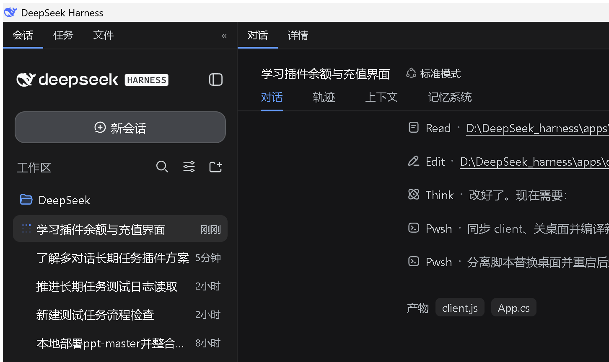

# dsh-wallet

DeepSeek Harness（DSH）钱包插件 —— 在左栏底部常驻显示 **DeepSeek 账户余额** 与 **当前会话消耗成本**，一键跳转官方平台充值 / 管理 API Key。

## ✨ 功能

| 模块 | 能力 |
| --- | --- |
| 余额查询 | 调官方 `GET api.deepseek.com/user/balance`（Bearer 鉴权），CNY / USD 双余额池（总余额 / 赠金 / 充值余额） |
| 会话成本 | 用 DSH token-meter 投影 × 官方价格表，实时估算**当前会话消耗金额**；悬停金额展开输入 / 缓存命中 / 输出的 token 量与金额明细 |
| 峰谷计价 | 已内置 2026-08-17 生效的官方峰谷价：高峰时段（北京 9:00–12:00、14:00–18:00）自动按高峰价，其余空闲价 |
| 低余额告警 | CNY < ¥10 或 USD < $2 时面板标红提醒充值 |
| 一键充值 | 点击「充值」在 **DSH 窗口内**打开官方充值页 `platform.deepseek.com/top_up`（不弹系统浏览器） |
| API Key | 自动读取 DSH 凭据 `DEEPSEEK_API_KEY`，点击「API Key」在 DSH 窗口内打开官方 Keys 页 |
| 模型工具 | 注册 `query_deepseek_balance`，直接问「余额还剩多少」AI 也能答 |

## 🖼 界面



左栏（侧边栏）底部常驻一块「DeepSeek 钱包」面板（约 1/4 高度）：

```
DeepSeek 钱包                     ↻
余额 CNY 36.66
本会话消耗  ¥1.23 [基础价]  ← 悬停展开 token/金额明细
⚠ 余额偏低，建议充值
[充值] [API Key] [明细]
```

## 🏗 架构

```
Host（Node 进程）
├─ 余额查询：Node 原生 fetch → api.deepseek.com/user/balance（30s 缓存）
├─ 会话成本：sessionProjections.tokenUsage × 价格表（flash/pro，含峰谷）
├─ RPC：/wallet/api/balance · refresh · cost?session=<id>
└─ 模型工具：query_deepseek_balance

Client（浏览器）
├─ 入口：sidebar.footer.action（左栏底部常驻面板，24vh）
├─ 余额 + 会话成本 + 低余额告警 + 充值/API Key 入口
└─ 当前会话 id 经 useSyncExternalStore 订阅 sessions.list，切换会话即时刷新
```

## 📦 安装

1. 将本目录放到 `~/.dsh/profiles/node_modules/dsh-wallet`
2. 在 `~/.dsh/profiles/web/cordis.patch.yml` 追加：

```yaml
- insert:
    - id: dsh-wallet
      name: 'dsh-wallet'
```

3. 重启 `dsh web`

> 注：「充值 / API Key」在 DSH 窗口内打开官方页，需要桌面端 dsh-desktop 处理 `NewWindowRequested` 事件（在本仓库之外，参考 `dsh-balance-meter` 生态做法）。

## 💰 价格表（元 / 百万 token）

| 模型 | 输入(缓存命中) | 输入(未命中) | 输出 | 峰谷 |
| --- | --- | --- | --- | --- |
| deepseek-v4-flash | 0.02 | 1 | 2 | 空闲 0.05/1.5/4.5 · 高峰 0.10/3.0/9.0 |
| deepseek-v4-pro | 0.025 | 3 | 6 | 空闲 0.15/4.5/13.5 · 高峰 0.30/9.0/27.0 |

峰谷价于北京时间 2026-08-17 00:00 起生效，插件按当前时刻自动切换。

## 许可

MIT。会话成本计价思路参考 [dsh-balance-meter](https://github.com/Ghost011118/dsh-balance-meter)（MIT）。
